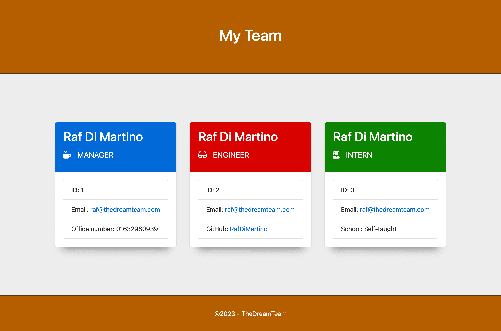
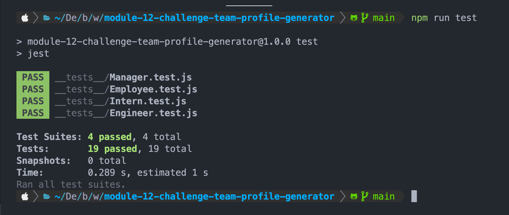

# Test-Driven Development: Team Profile Generator

## Description

In thins challenge I had to create an application that takes in information about employees on a software engineering team, then generates an HTML webpage that displays summaries for each person.
The Application is using [Inquirer.js](https://www.npmjs.com/package/inquirer) for gathering user's inputs and [Jest.js](https://jestjs.io/)
for test driven development, the application is built in node.js and uses ES6 sintax.

## Table of contents
* [Installation](#installation)
* [Usage](#usage)
* [Test](#test)
* [License](#license)

## Installation
Clone the repo to your machine and open a terminal of your choice navigate to the root of the newly cloned folder and run `npm install` in the terminal. You are all set now to run the program.

## Usage
After the installation instructions, in the terminal, run `node index.js`, you will prompted with some question to answer, you will be able to add different employee profiles: Manager, Engineer, Intern, 

You can exit the program by choosing `Complete the team and generate the landing page` from the list of options or by pressing `ctrl + c`.

At the end of the program, from your answers a `team.html` will be generated in the folder `output`

The following screenshot shows an example of the generated html file:

## Test
This application uses [Jest.js](https://jestjs.io/) for unit testing,
to run the Jest tests, open the terminal, navigate to the root folder of the project and run `npm run test`

The following screenshot shows test results:

## License
This software is distributed under the MIT-licence

